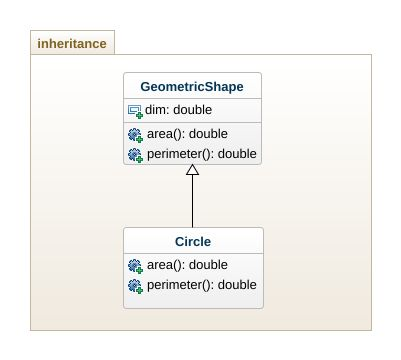
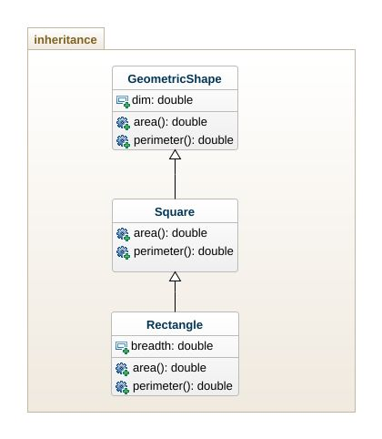
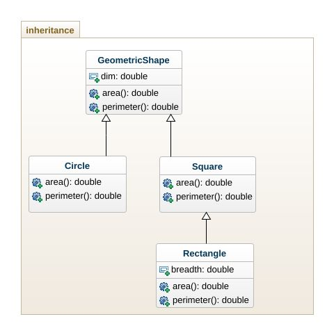

# Inheritance Types :
## 1. Simple Inheritance



```java
//File Name: GeometricShape.java
package inheritance;

public class GeometricShape {
	public double dim;
	
	public double area() {
		System.out.println("This is area()");
		return 0.0;
	}
	
	public double perimeter() {
		System.out.println("this is perimeter()");
		return 0.0;
	}
}
```

```java
//File Name: Circle.java

package inheritance;

public class Circle extends GeometricShape{
    //override area() method here to return area of a circle.
    // dim is treated as radius
	public double area() {
		return Math.PI * dim * dim;
	}
	
    //override perimeter() method here to return perimeter of circle
    // dim is treated as radius
	public double perimeter() {
		return 2.0 * Math.PI * dim;
	}
}

```

```java
//File Name: TestInheritance.java
package inheritance;

public class TestInheritance {

	public static void main(String[] args) {
		GeometricShape shp = new GeometricShape();
		shp.area();
		shp.perimeter();
		
		Circle c = new Circle();
		c.dim = 12.5;
		System.out.println(c.area()); 
		System.out.println(c.perimeter()); 

	}

}

```

## 2. Multi-Level Inheriance



```java
//File Name: GeometricShape.java
package inheritance;

public class GeometricShape {
	public double dim;
	
	public double area() {
		System.out.println("This is area()");
		return 0.0;
	}
	
	public double perimeter() {
		System.out.println("this is perimeter()");
		return 0.0;
	}

}
```

```java
//File Name: Circle.java

package inheritance;

public class Circle extends GeometricShape{
	public double area() {
		return Math.PI * dim * dim;
	}
	
	public double perimeter() {
		return 2.0 * Math.PI * dim;
	}
}

```

```java
//File Name: Rectangle.java

package inheritance;

public class Rectangle extends GeometricShape{
	public double breadth;
	
	//override area() here
	public double area() {
		return dim * breadth;
	}
	
	//override perimeter() here
	public double perimeter() {
		return 2.0 * (dim + breadth);
	}
	
}

```

```java
//File Name: TestInheritance.java
package inheritance;

public class TestInheritance {

	public static void main(String[] args) {
		GeometricShape shp = new GeometricShape();
		shp.area();
		shp.perimeter();
		
		Circle c = new Circle();
		c.dim = 12.5;
		System.out.println(c.area()); 
		System.out.println(c.perimeter()); 
		
		Rectangle r = new Rectangle();
		r.dim = 5.0;
		r.breadth = 4.0;
		System.out.println(r.area());
		System.out.println(r.perimeter());

	}

}

```

## 3. Hierarchical Inheritance


## 4. Hybrid Inheritance


## 5. Multiple Inheritance
