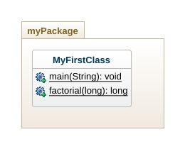
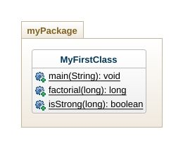
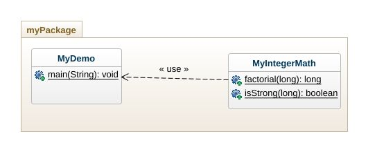
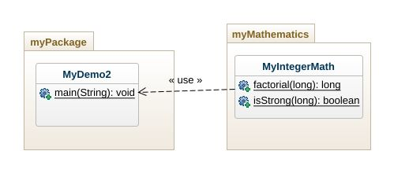
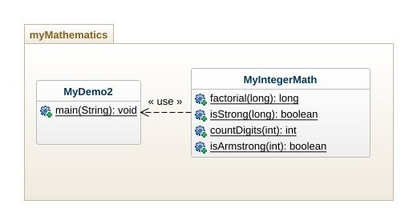
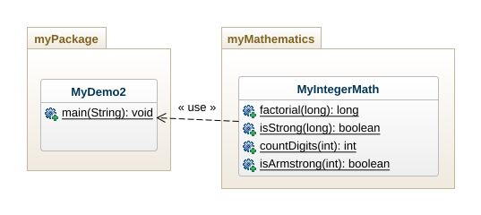

# Experiment-01: Prerequisite: Java fundamentals- Operators, Conditions, loops and output statement

## 1. Write a Java Program to print the “Hello World” statement.

```java
//File Name: HelloWorld.java

package experment01;

public class HelloWrold {

	public static void main(String[] args) {
		System.out.println("Welcome to Java Programming!!!");
	}

}

```

## ouput
```console

Welcome to Java Programming!!!

```

## 2. Write a Java program to compute the factorial of a number (assume hardcoded user input) in main method


```java
//File Name: MyFirstClass.java
package experment01.myPackage;

public class MyFirstClass {

	public static void main(String[] args) {
		//static member method can be directly called in static method
		long ans = factorial(5);
		System.out.println("factorial(5): " + ans);
		
		//static method call through class name
		long ans1 = MyFirstClass.factorial(6);
		System.out.println("MyFirstClass.factorial(6): "+ans1);
		
		//static method call through object name
		MyFirstClass obj = new MyFirstClass();
		long ans2 = obj.factorial(7);
		System.out.println("obj.factorial(7): "+ans2);
		
		//static method call through anonymous object creation
		long ans3 = new MyFirstClass().factorial(8);
		System.out.println("new MyFirstClass().factorial(8): "+ans3);
	}
	
	public static long factorial(int num) {
		long fact = 1;
		for(int i=1; i<=num; i++) {
			fact = fact * i;
		}
		
		return fact;
	}

}


```

## Output
```console
factorial(5): 120
MyFirstClass.factorial(6): 720
obj.factorial(7): 5040
new MyFirstClass().factorial(8): 40320
```
## 3. Develop Java code with 2 methods in MyFirstClass a) factorial () b) isStrong() Strong number is a special number whose sum of factorial of digits is equal to the original number. For example: 145 is strong number. Since, 1! + 4! + 5! = 145. The method expects an integer as argument and then returns true if the number is strong, otherwise returns false.



```java
//File Name: MyFirstClass.java
package experment01.myPackage;

public class MyFirstClass {

	public static void main(String[] args) {
		//static member method can be directly called in static method
		long ans = factorial(5);
		System.out.println("factorial(5): " + ans);
		
		//static method call through class name
		long ans1 = MyFirstClass.factorial(6);
		System.out.println("MyFirstClass.factorial(6): "+ans1);
		
		//static method call through object name
		MyFirstClass obj = new MyFirstClass();
		long ans2 = obj.factorial(7);
		System.out.println("obj.factorial(7): "+ans2);
		
		//static method call through anonymous object creation
		long ans3 = new MyFirstClass().factorial(8);
		System.out.println("new MyFirstClass().factorial(8): "+ans3);
		
		int num = 145;
		System.out.println("MyFirstClass.isStrong(num): "+MyFirstClass.isStrong(num));
		
		num = 125;
		System.out.println("MyFirstClass.isStrong(num): "+MyFirstClass.isStrong(num));
	
	}
	
	public static int factorial(int num) {
		int fact = 1;
		for(int i=1; i<=num; i++) {
			fact = fact * i;
		}
		
		return fact;
	}
	
	public static boolean isStrong(int num) {
		int sum = 0;
		int temp = num;
		while(num>0) {
			//find last digit from num
			int digit = num % 10;
			sum = sum + MyFirstClass.factorial(digit);
			
			//remove last digit from num
			num = num / 10;
			
		}
		
		if(temp == sum)
			return true;
		else
			return false;
	}

}

```

## Output

```console
factorial(5): 120
MyFirstClass.factorial(6): 720
obj.factorial(7): 5040
new MyFirstClass().factorial(8): 40320
MyFirstClass.isStrong(num): true
MyFirstClass.isStrong(num): false
```

## 4. Rework of Q3, modularizing to a class level as follows:



```java
File Name: MyDemo.java
package experment01.myPackage;

public class MyDemo {

	public static void main(String[] args) {
		//static member method can be directly called in static method
		//long ans = factorial(5);
		//System.out.println("factorial(5): " + ans);
		
		//static method call through class name
		long ans1 = MyFirstClass.factorial(6);
		System.out.println("MyFirstClass.factorial(6): "+ans1);
		
		//static method call through object name
		MyFirstClass obj = new MyFirstClass();
		long ans2 = obj.factorial(7);
		System.out.println("obj.factorial(7): "+ans2);
		
		//static method call through anonymous object creation
		long ans3 = new MyFirstClass().factorial(8);
		System.out.println("new MyFirstClass().factorial(8): "+ans3);
		
		int num = 145;
		System.out.println("MyFirstClass.isStrong(num): "+MyFirstClass.isStrong(num));
		
		num = 125;
		System.out.println("MyFirstClass.isStrong(num): "+MyFirstClass.isStrong(num));
	
	}

}

```

```java
//File Name: MyIntegerMath.java

package experment01.myPackage;

public class MyIntegerMath {
	public static int factorial(int num) {
		int fact = 1;
		for(int i=1; i<=num; i++) {
			fact = fact * i;
		}
		
		return fact;
	}
	
	public static boolean isStrong(int num) {
		int sum = 0;
		int temp = num;
		while(num>0) {
			//find last digit from num
			int digit = num % 10;
			sum = sum + MyFirstClass.factorial(digit);
			
			//remove last digit from num
			num = num / 10;
			
		}
		
		if(temp == sum)
			return true;
		else
			return false;
	}
}

```

## Output

```console
MyFirstClass.factorial(6): 720
obj.factorial(7): 5040
new MyFirstClass().factorial(8): 40320
MyFirstClass.isStrong(num): true
MyFirstClass.isStrong(num): false
```

## 5. Rework on Q4, modularizing to package level.



```java
//File Name: MyDemo2.java
package experment01.myPackage;

//import MyIntegerMath class here
import experment01.myMathematics.MyIntegerMath;

public class MyDemo2 {

	public static void main(String[] args) {
		//static member method can be directly called in static method
		//long ans = factorial(5);
		//System.out.println("factorial(5): " + ans);
		
		//static method call through class name
		long ans1 = MyIntegerMath.factorial(6);
		System.out.println("MyFirstClass.factorial(6): "+ans1);
		
		//static method call through object name
		MyIntegerMath obj = new MyIntegerMath();
		long ans2 = obj.factorial(7);
		System.out.println("obj.factorial(7): "+ans2);
		
		//static method call through anonymous object creation
		long ans3 = new MyIntegerMath().factorial(8);
		System.out.println("new MyIntegerMath().factorial(8): "+ans3);
		
		int num = 145;
		System.out.println("MyIntegerMath.isStrong(num): "+MyIntegerMath.isStrong(num));
		
		num = 125;
		System.out.println("MyIntegerMath.isStrong(num): "+MyIntegerMath.isStrong(num));
	
	}

}

```

```java
//File Name: MyIntegerMath.java
package experment01.myMathematics;

public class MyIntegerMath {
	public static int factorial(int num) {
		int fact = 1;
		for(int i=1; i<=num; i++) {
			fact = fact * i;
		}
		
		return fact;
	}
	
	public static boolean isStrong(int num) {
		int sum = 0;
		int temp = num;
		while(num>0) {
			//find last digit from num
			int digit = num % 10;
			sum = sum + MyIntegerMath.factorial(digit);
			
			//remove last digit from num
			num = num / 10;
			
		}
		
		if(temp == sum)
			return true;
		else
			return false;
	}
}

```

```console
MyFirstClass.factorial(6): 720
obj.factorial(7): 5040
new MyIntegerMath().factorial(8): 40320
MyIntegerMath.isStrong(num): true
MyIntegerMath.isStrong(num): false
```

## Problem Statement-06
6. Modify MyIntegerMath class, such that it contains the following methods.
1) countDigits()
2) isArmstrong().

countDigits() expects an integer as argument and returns the number of digits in it.

isArmstrong() expects an integer as argument and returns true if it is an Armstrong number otherwise returns false.

A positive integer of n digits is called an Armstrong number of order n (order is number
of digits) if abcd... = pow(a,n) + pow(b,n) + pow(c,n) + pow(d,n) + ....

Draw the class diagrams:
1) modularized to class level



2) modularized to package level



```java
//File Name: MyDemo2.java
package experment01.myMathematics;

public class MyDemo2 {

	public static void main(String[] args) {
		//static member method can be directly called in static method
		//long ans = factorial(5);
		//System.out.println("factorial(5): " + ans);
		
		//static method call through class name
		long ans1 = MyIntegerMath.factorial(6);
		System.out.println("MyFirstClass.factorial(6): "+ans1);
		
		//static method call through object name
		MyIntegerMath obj = new MyIntegerMath();
		long ans2 = obj.factorial(7);
		System.out.println("obj.factorial(7): "+ans2);
		
		//static method call through anonymous object creation
		long ans3 = new MyIntegerMath().factorial(8);
		System.out.println("new MyIntegerMath().factorial(8): "+ans3);
		
		int num = 145;
		System.out.println("MyIntegerMath.isStrong(num): "+MyIntegerMath.isStrong(num));
		
		num = 125;
		System.out.println("MyIntegerMath.isStrong(num): "+MyIntegerMath.isStrong(num));
	
		num = 4857;
		System.out.println("MyIntegerMath.countDigits(num): "+MyIntegerMath.countDigits(num));
		
		num = 1634;
		System.out.println("MyIntegerMath.isArmstrong(num): "+ MyIntegerMath.isArmstrong(num));
	}

}

```
```java
//File Name: 
package experment01.myMathematics;

public class MyIntegerMath {
	public static int factorial(int x) {
		int fact = 1;
		for(int i=1; i<=x; i++) {
			fact = fact * i;
		}
		
		return fact;
	}
	
	public static boolean isStrong(int x) {
		int sum = 0;
		int temp = x;
		while(x>0) {
			//find last digit from x
			int digit = x % 10;
			sum = sum + MyIntegerMath.factorial(digit);
			
			//remove last digit from x
			x = x / 10;
			
		}
		
		if(temp == sum)
			return true;
		else
			return false;
	}
	
	public static int countDigits(int x) {
		int count = 0;
		while(x>0) {
			count++;
			x /= 10;
		}
		
		return count;
	}
	
	public static boolean isArmstrong(int x) {
		int digits = MyIntegerMath.countDigits(x);
		int temp = x;
		int sum = 0;
		while(x>0) {
			int digit = x % 10;
			sum =  sum + (int)(Math.pow(digit, digits));
			
			x /= 10;
		}
		
		if(temp == sum)
			return true;
		else
			return false;
	}
}

```

```console
MyFirstClass.factorial(6): 720
obj.factorial(7): 5040
new MyIntegerMath().factorial(8): 40320
MyIntegerMath.isStrong(num): true
MyIntegerMath.isStrong(num): false
MyIntegerMath.countDigits(num): 4
MyIntegerMath.isArmstrong(num): true
```

## Problem Statement-07
7. Develop java code for the above designs a) and b).

```java
//File Name: MyDemo3.java

package experment01.myPackage;

//import MyIntegerMath class here
import experment01.myMathematics.MyIntegerMath;

public class MyDemo3 {

	public static void main(String[] args) {
		//static member method can be directly called in static method
		//long ans = factorial(5);
		//System.out.println("factorial(5): " + ans);
		
		//static method call through class name
		long ans1 = MyIntegerMath.factorial(6);
		System.out.println("MyFirstClass.factorial(6): "+ans1);
		
		//static method call through object name
		MyIntegerMath obj = new MyIntegerMath();
		long ans2 = obj.factorial(7);
		System.out.println("obj.factorial(7): "+ans2);
		
		//static method call through anonymous object creation
		long ans3 = new MyIntegerMath().factorial(8);
		System.out.println("new MyIntegerMath().factorial(8): "+ans3);
		
		int num = 145;
		System.out.println("MyIntegerMath.isStrong(num): "+MyIntegerMath.isStrong(num));
		
		num = 125;
		System.out.println("MyIntegerMath.isStrong(num): "+MyIntegerMath.isStrong(num));
	
		num = 4857;
		System.out.println("MyIntegerMath.countDigits(num): "+MyIntegerMath.countDigits(num));
		
		num = 1634;
		System.out.println("MyIntegerMath.isArmstrong(num): "+ MyIntegerMath.isArmstrong(num));
	}

}

```

```java
//File Name: MyIntegerMath.java

package experment01.myMathematics;

public class MyIntegerMath {
	public static int factorial(int x) {
		int fact = 1;
		for(int i=1; i<=x; i++) {
			fact = fact * i;
		}
		
		return fact;
	}
	
	public static boolean isStrong(int x) {
		int sum = 0;
		int temp = x;
		while(x>0) {
			//find last digit from x
			int digit = x % 10;
			sum = sum + MyIntegerMath.factorial(digit);
			
			//remove last digit from x
			x = x / 10;
			
		}
		
		if(temp == sum)
			return true;
		else
			return false;
	}
	
	public static int countDigits(int x) {
		int count = 0;
		while(x>0) {
			count++;
			x /= 10;
		}
		
		return count;
	}
	
	public static boolean isArmstrong(int x) {
		int digits = MyIntegerMath.countDigits(x);
		int temp = x;
		int sum = 0;
		while(x>0) {
			int digit = x % 10;
			sum =  sum + (int)(Math.pow(digit, digits));
			
			x /= 10;
		}
		
		if(temp == sum)
			return true;
		else
			return false;
	}
}


```
```console
MyFirstClass.factorial(6): 720
obj.factorial(7): 5040
new MyIntegerMath().factorial(8): 40320
MyIntegerMath.isStrong(num): true
MyIntegerMath.isStrong(num): false
MyIntegerMath.countDigits(num): 4
MyIntegerMath.isArmstrong(num): true
```